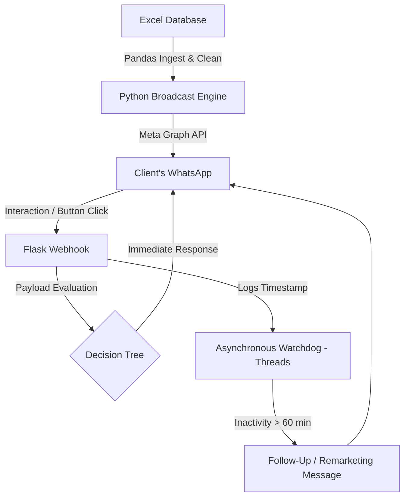
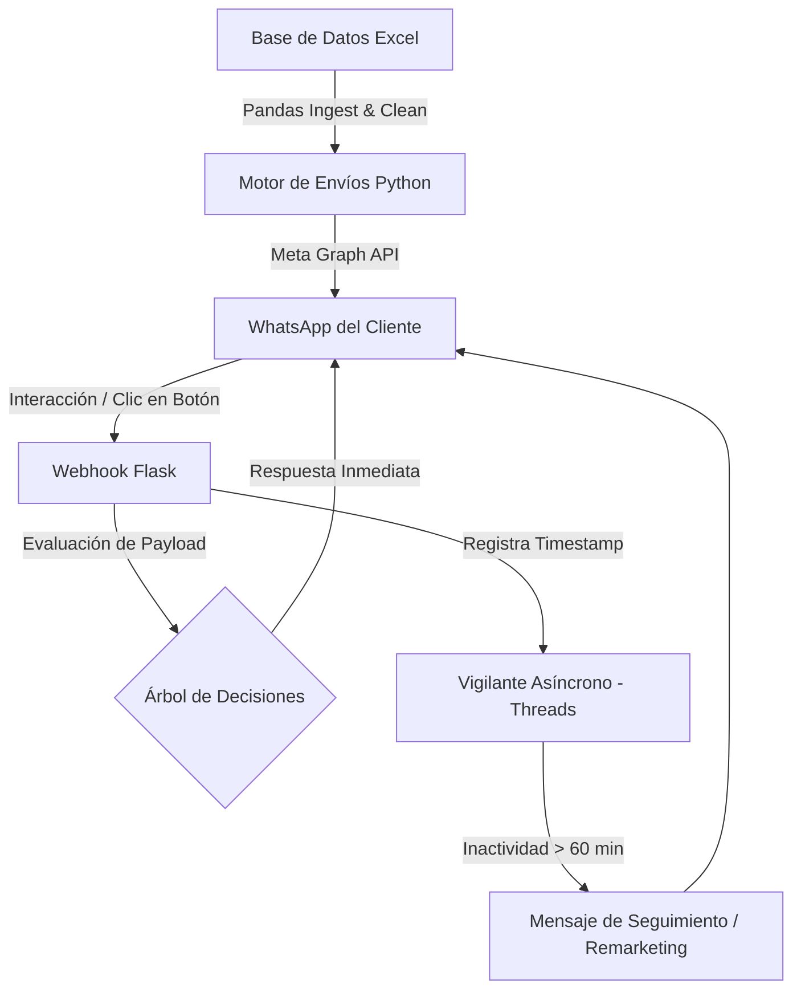

# 🚀 WhatsApp Business API: Automated Prospecting & Follow-Up Engine

End-to-end automated lead prospecting and qualification system, integrated directly with the **Meta Graph API (WhatsApp Cloud API)**. 

It combines a batch-segmented broadcast engine with an asynchronous webhook receiver and a background watchdog for the automatic recovery of inactive prospects (remarketing/abandoned cart).

---

## 📌 Key Features

* **Ingestion & Sanitization Engine (Pandas):** Reads Excel (`.xlsx`) databases, normalizes international dialing codes (`+57`), cleans numeric formats, and parameterizes official Meta templates.
* **Interactive Decision Tree:** Real-time handling of interactive button responses (`quick_reply`, `interactive buttons`) to guide the user through the sales funnel.
* **Asynchronous Recovery Monitor (`threading`):** Tracks lead inactivity. If a user abandons the flow before completing an action, the system automatically triggers a scheduled reminder without blocking the main server.
* **Decoupled Architecture:** Clear separation between the outbound dispatcher (`motor_envios.py`) and the inbound event receiver (`bot_webhook.py`).

---

## 🏗️ Architecture Flow

# 🚀 WhatsApp Business API: Automated Prospecting & Follow-Up Engine

Sistema automatizado de prospección y cualificación de leads de punta a punta, integrado directamente con la **Meta Graph API (WhatsApp Cloud API)**. 

Combina un motor de envíos segmentados por lotes con un receptor webhook asíncrono y un monitor en segundo plano (*Background Watchdog*) para la recuperación automática de prospectos inactivos (remarketing/carrito abandonado).

---

## 📌 Características Principales

* **Motor de Ingesta y Sanitización (Pandas):** Lee bases de datos en Excel (`.xlsx`), normaliza prefijos internacionales (`+57`), limpia formatos decimales y parametriza plantillas oficiales de Meta.
* **Árbol de Decisión Interactivo:** Manejo en tiempo real de respuestas de botones interactivos (`quick_reply`, `interactive buttons`) para guiar al usuario a través del embudo de ventas.
* **Monitor Asíncrono de Recuperación (`threading`):** Monitorea la inactividad del lead. Si un usuario abandona el flujo antes de completar la acción, el sistema dispara automáticamente un recordatorio programado sin bloquear el servidor.
* **Arquitectura Desacoplada:** Separación clara entre el despachador saliente (`motor_envios.py`) y el receptor de eventos entrantes (`bot_webhook.py`).

---

## 🏗️ Flujo de Arquitectura

## 📸 Live Demo / Demostración Visual

